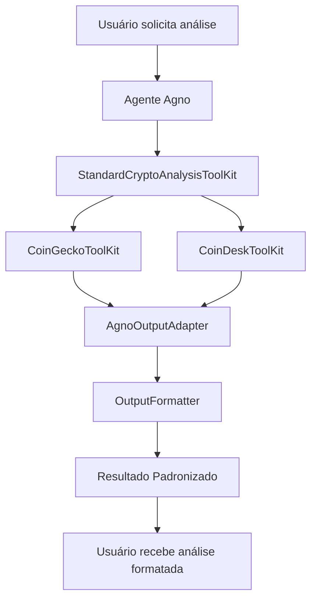

# Sistema de Output Padronizado para Análises de Cripto

## Visão Geral

Este sistema implementa outputs padronizados e consistentes para análises de criptomoedas usando o framework **Agno**. Ele fornece estruturas de dados organizadas, formatação consistente e integração direta com os toolkits existentes do projeto.

## 🚀 Características Principais

### ✅ **Outputs Consistentes**
- Formatação padronizada em Markdown, JSON e resumos compactos
- Estrutura uniforme para todos os tipos de análise
- Emojis e símbolos para melhor visualização

### ✅ **Multi-Timeframe Integrado**
- Análises técnicas separadas para curto e longo prazo
- Comparação automática entre diferentes horizontes temporais
- Interpretação contextualizada de divergências

### ✅ **Análise Abrangente**
- Combinação automática de dados técnicos, fundamentais e de sentimento
- Score de confiança baseado na convergência de indicadores
- Riscos, oportunidades e takeaways estruturados

### ✅ **Flexibilidade de Uso**
- 3 níveis de análise: completa, resumo rápido, comparação
- Formatos múltiplos: Markdown (padrão), JSON, resumo compacto
- Integração transparente com agente Agno existente

## 📁 Arquivos do Sistema

```
src/agente/
├── output_formatter.py           # Classes base e formatadores
├── agno_output_adapter.py        # Adaptador para respostas do Agno
├── standard_crypto_toolkit.py    # ToolKit integrado ao Agno
├── exemplo_output_padronizado.py # Exemplos de uso
└── README_OUTPUT_PADRONIZADO.md  # Esta documentação
```

## 🛠️ Como Usar

### 1. Integração com Agente Agno

O sistema já está integrado ao agente principal em `app.py`. O agente automaticamente usará o `StandardCryptoAnalysisToolKit` para análises estruturadas.

```python
# O agente foi configurado para priorizar análises padronizadas
# As instruções foram atualizadas para usar o novo toolkit
```

### 2. Ferramentas Disponíveis

#### **comprehensive_crypto_analysis()**
Análise completa com output padronizado:

```python
# Usado automaticamente pelo agente para:
# - "Analise o Bitcoin"
# - "Quero análise técnica do Ethereum" 
# - "Previsão de preço para Cardano"

resultado = comprehensive_crypto_analysis(
    coin_id="bitcoin",
    include_sentiment=True,
    output_format="markdown"  # ou "json", "summary"
)
```

#### **quick_crypto_summary()**
Resumo compacto e rápido:

```python
# Usado para visões gerais rápidas
# - "Resumo rápido do Bitcoin"
# - "Como está o Ethereum hoje?"

resumo = quick_crypto_summary("ethereum")
```

#### **multi_crypto_comparison()**
Comparação estruturada entre moedas:

```python
# Usado para comparações
# - "Compare Bitcoin, Ethereum e Cardano"
# - "Qual cripto teve melhor performance?"

comparacao = multi_crypto_comparison(
    coin_ids=["bitcoin", "ethereum", "cardano"],
    comparison_metric="performance"  # ou "technical", "market_cap"
)
```

### 3. Formatos de Output

#### **Markdown (Padrão)**
```markdown
# 📊 Análise de Criptomoeda: Bitcoin (BTC)

## 🔍 Resumo Executivo
**Tendência Geral:** 📈 Alta  
**Confiança:** 78.5%  
**Timestamp:** 15/01/2024 às 14:30 UTC

## 💰 Dados de Mercado
| Métrica | Valor |
|---------|-------|
| **Preço Atual** | $45,000.00 |
| **Mudança 24h** | 🟢 +$1,200.50 (+2.75%) |
| **Market Cap** | $850.00B |

## 📈 Análise Técnica Multi-Timeframe
### 📊 Curto Prazo (30 dias)
**Tendência:** 📈 Alta  
**Confiança:** 75.0%

**📊 Indicadores Técnicos:**
- **RSI:** 58.50 🟡 (neutral)
- **MACD:** 850.2500 / Signal: 720.4000 🟢
- **SMA 20:** 44500.00
...
```

#### **JSON Estruturado**
```json
{
  "timestamp": "2024-01-15T14:30:00+00:00",
  "coin_id": "bitcoin",
  "coin_name": "Bitcoin",
  "coin_symbol": "BTC",
  "analysis_type": "comprehensive",
  "market_data": {
    "current_price": 45000.0,
    "price_change_24h": 1200.5,
    "price_change_percentage_24h": 2.75,
    "market_cap": 850000000000,
    "volume_24h": 25000000000
  },
  "overall_trend": "bullish",
  "confidence_score": 78.5,
  "key_takeaways": [
    "Tendência altista confirmada por múltiplos indicadores"
  ]
}
```

#### **Resumo Compacto**
```
📈 **BTC** | $45,000.00 (🟢 +2.75%) | Tendência: Bullish | Confiança: 79%
```

## 🔧 Configuração e Requisitos

### Variáveis de Ambiente
```bash
# Necessárias para funcionar corretamente
COINGECKO_API_KEY=your_api_key_here
COINDESK_API_KEY=your_api_key_here  # opcional
DEFAULT_VS_CURRENCY=usd
```

### Dependências
O sistema utiliza as mesmas dependências do projeto principal:
- `pandas-ta` (indicadores técnicos)
- `requests` (APIs)
- `python-dotenv` (configuração)
- Framework `agno` e seus componentes

## 📊 Estrutura de Dados

### Classes Principais

```python
@dataclass
class CryptoAnalysisResult:
    """Resultado completo de análise padronizada"""
    timestamp: str
    coin_id: str
    coin_name: str
    coin_symbol: str
    analysis_type: AnalysisType
    market_data: MarketData
    sentiment_data: Optional[SentimentData]
    timeframe_analyses: List[TimeframeAnalysis]
    overall_trend: TrendDirection
    confidence_score: float
    key_takeaways: List[str]
    risk_factors: List[str]
    opportunities: List[str]
```

### Enums de Suporte
```python
class AnalysisType(Enum):
    TECHNICAL = "technical"
    FUNDAMENTAL = "fundamental"  
    SENTIMENT = "sentiment"
    COMPREHENSIVE = "comprehensive"

class TrendDirection(Enum):
    BULLISH = "bullish"
    BEARISH = "bearish"
    SIDEWAYS = "sideways"
    UNCERTAIN = "uncertain"

class TimeframeType(Enum):
    SHORT_TERM = "short_term"    # 1-30 days
    MEDIUM_TERM = "medium_term"  # 30-90 days
    LONG_TERM = "long_term"      # 90+ days
```

## 🧪 Exemplos e Testes

Execute o script de exemplos para ver todas as funcionalidades:

```bash
cd src/agente
python exemplo_output_padronizado.py
```

O script demonstra:
1. ✅ Análise completa do Bitcoin
2. ✅ Resumos rápidos de múltiplas moedas
3. ✅ Comparações estruturadas
4. ✅ Diferentes formatos de output
5. ✅ Uso manual do formatter

## 🎯 Benefícios do Sistema

### **Para o Agente**
- Respostas consistentes e profissionais
- Redução de variabilidade nos outputs
- Estruturação automática de dados complexos

### **Para o Usuário**
- Informações organizadas e fáceis de interpretar
- Formatos flexíveis conforme necessidade
- Análises mais robustas e confiáveis

### **Para o Desenvolvimento**
- Facilita manutenção e expansão
- Código modular e testável
- Integração transparente com Agno

## 🔄 Fluxo de Funcionamento



## 🚨 Considerações de Uso

### **Pontos Positivos**
- ✅ Outputs consistentes e profissionais
- ✅ Integração transparente com código existente
- ✅ Flexibilidade de formatos
- ✅ Análise multi-timeframe automática
- ✅ Combinação inteligente de indicadores

### **Limitações**
- ⚠️ Depende da qualidade dos dados das APIs
- ⚠️ Parsing de texto pode ocasionalmente falhar
- ⚠️ Requer configuração de API keys
- ⚠️ Performance depende da latência das APIs

### **Boas Práticas**
1. **Sempre configurar** as variáveis de ambiente
2. **Monitorar** a qualidade dos dados retornados
3. **Usar formatos apropriados** para cada contexto
4. **Testar regularmente** com diferentes moedas
5. **Acompanhar** atualizações das APIs

## 🔮 Expansões Futuras

### Funcionalidades Planejadas
- [ ] Análise de padrões gráficos (Head & Shoulders, etc.)
- [ ] Integração com análise on-chain
- [ ] Alertas automáticos baseados em indicadores
- [ ] Análise de correlação entre ativos
- [ ] Dashboard visual das análises
- [ ] Exportação para PDF/Excel
- [ ] Backtesting de sinais

### Melhorias Técnicas
- [ ] Cache inteligente de dados
- [ ] Retry automático com fallback
- [ ] Logging estruturado
- [ ] Métricas de performance
- [ ] Validação de dados mais robusta

## 📞 Suporte

Para dúvidas, bugs ou sugestões relacionadas ao sistema de output padronizado:

1. Verifique os logs de erro no console
2. Teste com o script `exemplo_output_padronizado.py`
3. Confirme configuração das variáveis de ambiente
4. Consulte esta documentação para padrões de uso

---

**Sistema implementado em:** Janeiro 2024  
**Framework utilizado:** Agno  
**Compatibilidade:** Python 3.8+  
**Status:** ✅ Produção
